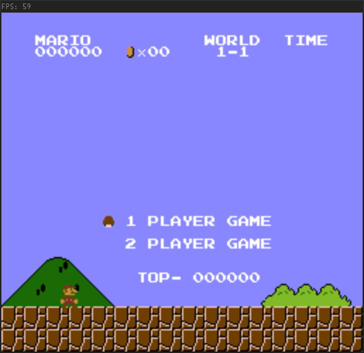

# NES Emulator

NES(Nintendo Entertainment System) emulator written in C++. This project was intended to learn about the 

<div align="center">

</div>

## How to Build

### Dependencies

Before building this project the following must be installed :
- [GLEW](http://glew.sourceforge.net/)
- [GLFW](https://www.glfw.org/download.html)
- [PortAudio](http://www.portaudio.com/)

### CMake

To keep this project platform independent CMake is used to generate the build files.
To install cmake in Windows, I used [chocolatey](https://chocolatey.org/) which is a package manager.

The following definitions can be used to locate the dependencies if they are not found automatically:
- CMAKE\_INCLUDE\_PATH
- CMAKE\_LIBRARY\_PATH

### Windows

I used [vcpkg](https://github.com/microsoft/vcpkg) to install the dependencies on Windows.

After setting up vcpkg, the following code snippets illustrate how to install the required dependencies.

```
vcpkg install glfw3:x64-windows
vcpkg install glew:x64-windows
vcpkg install portaudio:x64-windows
```

Once done, create a folder where you would want the repository to be cloned and perform the following commands to build the emulator.

```
git clone https://github.com/Sarvesh2k/NES_Emulator
cd NES_Emulator
mkdir build
cd build
cmake -G"Visual Studio 16 2019" -A x64 -DCMAKE_TOOLCHAIN_FILE=<path-to-vcpkg>/scripts/buildsystems/vcpkg.cmake ..
cmake --build . --target ALL_BUILD --config Release
```

### Linux

I haven't tried out running the emulator in linux based systems, but given that the project was intended to be platform independent, this will be explored in future iterations and the readme file will be updated.

For the curious, the following dependencies must be installed before proceeding (Ubuntu):

- `libglew-dev`
- `libglfw3-dev`
- `portaudio19-dev`

## How to Use the Emulator

### Running the emulator

This emulator opens the file passed through the command line arguments.
The NES_Emulator executable can be found in `<path-to-cloned-repo>\build\Debug`

```
(in the repo)
cd build\Debug
.\NES-Emulator <path-to-game-file>
```

The game file (i.e. the .nes file) can also be dragged onto the executable.

### Controls

The controls can be set up in a `settings.ini` file.

The default controls are

Player 1:
```
Directional Pad - WASD
Select - G
Start - H
A - K
B - J
```

Player 2:
```
Directional Pad - Arrow Keys
Select - Keypad 1
Start - Keypad 2
A - Keypad 3
B - Keypad 0
```

## Mappers supported

The mappers currently supported are NROM (0), MMC1 (1), UxROM (2), CNROM (3) and MMC3 (4).
the NES cartidges released in the US have only been used for testing.

## Scope of Improvement

This project was developed to obtain a deeper understanding of the underlying architecture behind the NES consoles, and hence was developed for the sole purpose of learning.

Some points that I noted that needed improvement are as follows:
- Gameplay optimization (testing brought about 60-70 FPS and 30-40 FPS in memory intensive games)
- External controller support (only provided support for keyboard)

## References

- The [NesDev Wiki](https://wiki.nesdev.com/w/index.php?title=Nesdev_Wiki) - The Holy Grail of the NES Console Documentation. Definitely a go-to source.
- javidx9 (One Line Coder)'s [Bulding the NES from Scratch](https://www.youtube.com/playlist?list=PLrOv9FMX8xJHqMvSGB_9G9nZZ_4IgteYf) Playlist - Provides an amazing in-depth practical implementation of the NES Emulator. Perfect for concept building